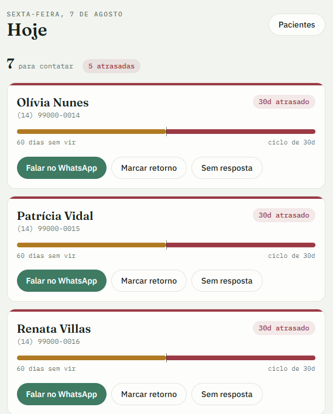
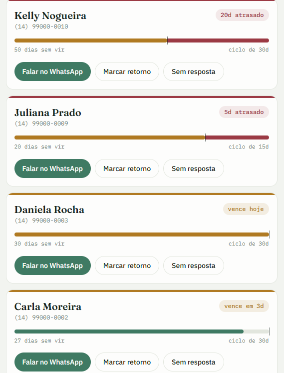
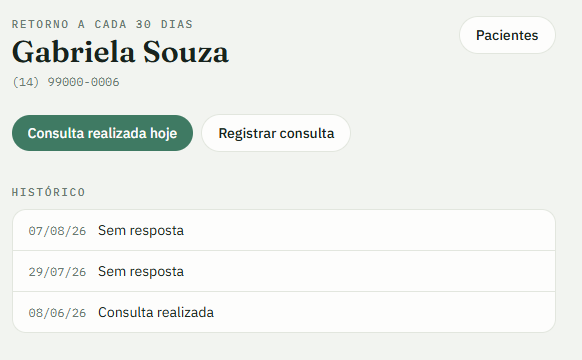

# Retorno

**Toda manhã, uma lista curta e confiável de quem precisa remarcar consulta.**

Sou nutricionista e escrevi isso para resolver um problema meu: é a minha lista que abre
às 8h da manhã. No ar, em uso real, com cerca de 30 pacientes ativos. A URL não é
divulgada: o sistema guarda dado de saúde e o acesso é de uma pessoa só, eu.

`Next.js 16` · `TypeScript` · `PostgreSQL` · `Prisma` · `Tailwind 4` · `shadcn/ui` · `Vitest` · `Vercel`

---

## O problema

O paciente termina a consulta, sai do consultório e some. Ninguém marca o retorno na
hora. Três semanas depois ele ainda lembra que precisa voltar; três meses depois já
desistiu do acompanhamento, e eu só percebo quando olho a agenda vazia e não sei dizer
quem sumiu.

O problema não é de agenda, é de memória. A informação existe (todo mundo tem um
intervalo de retorno recomendado), mas eu não consigo cruzar isso com "quem já foi
avisado" na cabeça, todo dia, para trinta pessoas.

O sistema resolve um problema só: lembrar quem precisa remarcar.

## A regra de negócio

É a parte que precisa estar certa antes de qualquer interface. Um paciente entra na
tela de hoje quando quatro condições valem:

1. está ativo;
2. tem ao menos uma consulta realizada;
3. `última consulta + intervalo de retorno` já venceu ou vence nos próximos 7 dias;
4. não existe consulta agendada no futuro.

A quinta condição — houve contato nos últimos 5 dias? — não tira ninguém da tela: ela
decide em qual das duas listas o paciente aparece. Sem contato recente, ele está em
**para contatar**, com o botão de WhatsApp em destaque. Com contato recente, ele desce
para **aguardando resposta**, onde o botão principal é marcar o retorno; ele só sai da
tela quando a consulta é agendada. Se os 5 dias passam sem resposta e sem consulta, ele
volta para o topo.

As condições 4 e 5 são o que separa uma lista útil de uma lista que mente: sem elas, o
sistema me faz cobrar na segunda alguém que já remarcou na sexta, e cobrar de novo na
quarta. Duas mensagens repetidas e eu paro de confiar na lista, e a partir daí o sistema
não serve mais pra nada. E a seção de aguardando existe porque mandar a mensagem não
encerra o caso: enquanto a consulta não está marcada, o paciente continua na minha
frente — só que sem risco de eu mandar mensagem duplicada.

As condições são uma pergunta só, então são uma query só ([`lib/recall.ts`](lib/recall.ts)),
e o corte dos 5 dias separa as duas listas logo depois:

```sql
WITH ultima AS (
  SELECT "pacienteId", MAX("dataHora") AS data
  -- data futura em consulta realizada é erro de digitação: ignorar, para
  -- que o paciente continue aparecendo em vez de sumir em silêncio.
  FROM "Consulta" WHERE status = 'REALIZADA' AND "dataHora" <= NOW()
  GROUP BY "pacienteId"
)
SELECT p.id, p.nome, p.telefone, p."intervaloDias",
       u.data AS "ultimaConsulta",
       u.data + (p."intervaloDias" || ' days')::interval AS "venceEm",
       (SELECT MAX(ct.data) FROM "Contato" ct WHERE ct."pacienteId" = p.id)
         AS "ultimoContato"
FROM "Paciente" p
JOIN ultima u ON u."pacienteId" = p.id
WHERE p.ativo
  AND u.data + (p."intervaloDias" || ' days')::interval <= NOW() + INTERVAL '7 days'
  AND NOT EXISTS (
    SELECT 1 FROM "Consulta" c
    WHERE c."pacienteId" = p.id AND c.status = 'AGENDADA' AND c."dataHora" > NOW()
  )
ORDER BY "venceEm" ASC, p.nome ASC;
```

O `AND "dataHora" <= NOW()` no CTE não estava na especificação original. Foi adicionado
depois de perceber o modo de falha: se alguém digitar 2027 no lugar de 2026 ao registrar
uma consulta realizada, o paciente sai da lista e nunca mais volta, sem erro nenhum. É o
tipo de falha silenciosa que ninguém vai investigar, porque nada parece quebrado.

## A tela



O contexto de uso é específico: 8h da manhã, no celular, com café na mão, entre um
paciente e outro. Eu preciso ler essa tela em cinco segundos.

A barra de ciclo é o elemento que carrega isso. O trilho representa o intervalo de
retorno daquele paciente; o preenchimento, o tempo decorrido. Quem passou do prazo
transborda o trilho, e o excedente sai em vinho. Um traço de 1px marca o fim do prazo,
senão o transbordo vira só troca de cor.



Os quatro cartões acima são o mesmo componente em quatro estados: 20 e 5 dias de atraso
(transbordo em vinho), vencendo hoje (trilho cheio, ocre) e faltando 3 dias (verde). Eu
varro a lista sem ler número nenhum, e o tamanho do transbordo é literalmente a métrica
que importa. Repare no terceiro: o ciclo dela é de 15 dias, não 30, e a barra é
proporcional ao intervalo de cada paciente, não a uma escala fixa.

Os contadores do topo são filtros: tocar em "atrasadas" reduz a lista a quem já passou
do prazo, e o filtro vive na URL (`/?filtro=atrasadas`) — a tela continua sendo um
Server Component, sem estado de cliente. Há modo escuro, porque às 8h da manhã de
inverno a tela clara incomoda de verdade.

A ficha junta consultas e contatos numa linha do tempo só, porque a pergunta que eu faço
olhando pra ela é sempre "o que aconteceu com essa pessoa, em ordem":



Ao lado do histórico, cada consulta realizada aceita uma anotação de prontuário — sobre
isso, mais abaixo, porque essa feature quase não entrou.

O botão de WhatsApp abre a conversa com o texto pré-preenchido e grava o contato no mesmo
clique. É isso que faz o paciente sumir da lista quando eu volto pro app, sem checkbox e
sem "marcar como feito".

## Decisões de engenharia

A parte interessante deste projeto está no escopo que ele recusou. Cada decisão abaixo
tem um trade-off explícito.

### `wa.me` em vez da WhatsApp Cloud API

A decisão mais importante do projeto, e a mais fácil de "melhorar" por engano.

O sistema não envia mensagens. Ele monta um link `wa.me` com o texto pronto; eu clico, o
WhatsApp abre, eu ajusto e envio com as minhas próprias mãos.

Motivo técnico: a Cloud API exige conta business verificada, templates aprovados pela
Meta e custo por conversa, desproporcional para 30 pacientes. Motivo de produto, que pesa
mais: mensagem automática destrói o vínculo, e o vínculo é exatamente o que eu vendo. Um
paciente que percebe que recebeu um robô não volta, e quem perde esse paciente sou eu.

> **Automatize a memória, não a conversa.**

### Três tabelas, e a terceira é a que importa

`Paciente`, `Consulta`, `Contato`. A terceira parece supérflua até faltar resposta para
"quem eu já avisei essa semana?", e a lista passar a cobrar a mesma pessoa três vezes.
Toda a condição 5 da regra vive nela.

### SQL cru para o recall

As cinco condições são uma pergunta só. Espalhadas em query builder, com um `NOT EXISTS`
virando subconsulta encadeada, fica mais difícil olhar e verificar que todas as cinco
estão lá. O resto do app usa Prisma normalmente; o SQL cru é para a única query que
precisa ser auditável de relance.

### UTC no banco, América/São_Paulo no cálculo

Um retorno que vence "hoje" precisa virar à meia-noite de Brasília, não de Londres.
Datas são gravadas ao meio-dia de Brasília (`date-fns-tz`), porque o sistema não é agenda
de horários: só precisa cair no dia certo, e meio-dia sobrevive a qualquer mudança de
fuso. A contagem de dias usa `differenceInCalendarDays` sobre datas já convertidas para o
fuso, nunca subtração de timestamps.

### Telefone validado contra o canal real, não contra a norma

Celular antigo de 8 dígitos é recusado de propósito: é formalmente um telefone válido,
mas não funciona mais no WhatsApp, que é o único canal que o sistema usa. Validar contra
a norma aceitaria um número que falha na entrega.

Número que começa com `+` e código de país diferente de 55 passa como está, validado só
pelo comprimento E.164, porque duas pacientes minhas moram fora do Brasil. Carregar uma
tabela de numeração de 200 países por causa de duas pessoas não se paga.

### Dependências: cada uma com um porquê

O projeto nasceu com oito dependências de runtime e ganhou mais algumas quando o visual
migrou para shadcn/ui (`@base-ui/react`, `class-variance-authority`, `clsx`,
`tailwind-merge`, `lucide-react`) — uma troca consciente: componentes copiados para o
repositório em vez de uma UI kit em `node_modules`, e uma biblioteca de ícones no lugar
de SVGs desenhados à mão. O que continua valendo é o critério: nenhuma dependência entra
para resolver problema que 30 linhas resolvem.

| Em vez de | Foi feito com |
|---|---|
| NextAuth / Auth.js | SHA-256 via `crypto.subtle` + cookie httpOnly, 12 linhas ([`lib/sessao.ts`](lib/sessao.ts)) |
| SDK da Resend | `fetch` direto na API REST |
| SDK `googleapis` | `fetch` na API REST do Calendar + OAuth por refresh token ([`lib/google-calendar.ts`](lib/google-calendar.ts)) |
| Parser de CSV | 34 linhas com `split` e erro numerado por linha ([`lib/csv.ts`](lib/csv.ts)) |
| libphonenumber | um `Set` com os 67 DDDs brasileiros válidos |
| Biblioteca de formulário | Server Actions + `useActionState` |
| Date picker | `<input type="date" min>` nativo |

É um sistema de usuário único com uma senha. Uma biblioteca de auth traria banco de
sessões, provedores OAuth e superfície de ataque que não existe aqui.

### Server Components por padrão

Oito componentes de cliente no app inteiro, exatamente onde há interação real: o card
da tela Hoje, o painel de prontuário, o alternador de tema e cinco formulários e botões.
Todo o resto — incluindo a tela Hoje inteira e seus filtros — renderiza no servidor.

## O escopo que mudou de ideia (e como)

A primeira versão deste README dizia "não é prontuário eletrônico", e o sistema rodou
meses assim. Depois o uso real mostrou uma dor específica: ao ligar para um paciente, eu
precisava lembrar o que tinha acontecido na última consulta, e essa informação estava num
caderno. Entraram duas features, com o escopo deliberadamente estreito
([spec e plano versionados em `docs/superpowers/`](docs/superpowers/)):

- **Prontuário por consulta** — um campo de texto por consulta realizada, limitado a
  5.000 caracteres ([`lib/consulta.ts`](lib/consulta.ts)). Reutiliza a coluna
  `Consulta.notas` que já existia; zero migração, zero tabela nova. Sem anamnese
  estruturada, sem exames, sem antropometria — texto livre, que é o que o caderno era.
- **Arquivar paciente** — pacientes que encerraram o acompanhamento saem da lista sem
  serem apagados (o histórico é dado de saúde; apagar não é opção). A regra de recall já
  filtrava por `p.ativo` desde o primeiro dia, então arquivar é um `UPDATE` de um campo:
  a query central não mudou uma linha.

O ponto de portfólio aqui não é a feature, é o processo: escopo recusado não é dogma,
é uma decisão com data de validade. Quando a dor apareceu, a resposta foi a menor
implementação que a resolvia — e o que continua de fora, continua de fora.

## Testes

56 testes, integração contra Postgres de verdade, sem mock de banco. A regra de negócio é
uma query SQL; testá-la contra um mock testaria o mock.

O detalhe que vale mostrar está em [`prisma/seed.ts`](prisma/seed.ts): cada caso do seed
declara a própria expectativa.

```ts
type Caso = {
  nome: string;
  consultas: { dataHora: Date; status: StatusConsulta }[];
  contatos?: { data: Date; resultado?: ResultadoContato }[];
  /** verdade esperada da regra central */
  aparece: boolean;
  porque: string;
};
```

[`lib/recall.test.ts`](lib/recall.test.ts) gera um teste por linha do seed. Adicionar um
caso-limite adiciona um teste, e o motivo aparece no nome do teste quando ele quebra.

Os casos que mais dizem sobre o sistema:

| Caso | Espera | Por quê |
|---|---|---|
| Mariana | não aparece | vence em 8 dias, um dia fora da janela de 7 |
| Patrícia | aparece | último contato cruzou os 5 dias por 1 hora |
| Olívia | aparece | consulta futura cancelada não conta como agendada |
| Kelly | aparece | faltou na última, mas a realizada de 50 dias atrás ainda vale |
| Renata | aparece | ano digitado errado numa realizada não pode escondê-la |

E um teste que não é sobre nenhum caso específico:

```ts
test("não inventa nem esquece ninguém", ...)
```

Ele compara o tamanho da lista com `CASOS.filter(c => c.aparece).length`. Sem ele, os
testes pegariam falso negativo (alguém sumiu) mas não falso positivo (alguém apareceu sem
dever), e é o falso positivo que me faz perder a confiança na lista.

```bash
npm test
```

## Acessibilidade e piso de qualidade

Tudo abaixo está implementado e dá pra conferir no código:

- Mobile-first de verdade, não adaptação: o celular é o dispositivo principal.
- Modo escuro completo, com preferência persistida.
- `prefers-reduced-motion` desliga todas as transições.
- Foco de teclado visível em tudo, via `:focus-visible`.
- Todo erro tem `role="alert"`; a barra de ciclo é `role="img"` com `aria-label` que diz
  o número de dias, para quem não enxerga a barra.
- Erros dizem o que aconteceu e o que fazer, e não pedem desculpa:
  *"Essa data já passou. Escolha hoje ou uma data futura."*
- O estado vazio da tela Hoje é uma boa notícia, e o texto diz isso: *"Tudo em dia."*
- Importação de CSV é parcial por design: as linhas boas entram, as ruins voltam com o
  número da linha e o motivo. Nada é tudo-ou-nada.

## LGPD

Dado de saúde é dado pessoal sensível, e isso mudou decisões concretas:

- O resumo diário por e-mail leva nome e prazo, nunca telefone, observação nem
  prontuário. É o único ponto onde dado sai do sistema, então é onde menos dado deve
  passar.
- O prontuário fica no banco e aparece só na ficha, atrás do login. Nenhum caminho o
  leva para fora: nem e-mail, nem exportação, nem log.
- Arquivar não apaga: histórico clínico se preserva, sai só da operação do dia a dia.
- O seed é fictício por obrigação, não por conveniência: nenhum dado real versionado.
- Banco nunca exposto publicamente; conexão só por variável de ambiente.

## O que ficou de fora, de propósito

Nada abaixo é backlog. É escopo recusado:

- Não é prontuário eletrônico completo. A anotação por consulta é texto livre; anamnese
  estruturada, exames, antropometria e evolução gráfica continuam fora.
- Não é software de prescrição. Sem plano alimentar, cálculo de macros, tabela TACO.
- Não é agenda de horários. Sem grade semanal, blocos, disponibilidade, encaixe.
- Não tem app nem login para o paciente. O paciente nunca acessa o sistema.
- Não tem multiusuário, times, permissões ou papéis.
- Não tem financeiro, cobrança ou emissão de recibo.

Cada item desses é um produto inteiro, e cada um teria adiado indefinidamente a única
coisa que resolvia a dor real. Como eu sou o usuário, a pergunta "isso me faz falta na
segunda de manhã?" tinha resposta na hora, e para quase tudo a resposta foi não. Foi por
isso que o sistema chegou em produção rápido.

## Arquitetura

```
app/
  page.tsx                    tela Hoje — Server Component, chama a query do recall
  card-paciente.tsx           o card e a barra de ciclo (client)
  actions.ts                  registrar contato, marcar retorno
  entrar/                     login por senha única
  pacientes/                  lista (com toggle de arquivados), cadastro, importação de CSV
  pacientes/[id]/             ficha, prontuário por consulta, arquivar/reativar
  api/cron/resumo/            e-mail diário das 7h (Vercel Cron + Resend)
lib/
  recall.ts                   a regra de negócio, em SQL
  paciente.ts                 normalização e validação de telefone (Zod)
  consulta.ts                 validação do prontuário (limite de 5.000 caracteres)
  google-calendar.ts          espelha consultas marcadas na Google Agenda (opcional)
  csv.ts                      importação por colagem
  mensagem.ts                 o texto e o link wa.me
  sessao.ts                   selo de sessão (SHA-256)
proxy.ts                      middleware de senha (Next 16 renomeou middleware.ts)
prisma/seed.ts                16 casos-limite com a expectativa declarada
```

O cron (`0 10 * * 1-5` = 7h de Brasília, dias úteis) chama exatamente a mesma função que
a interface usa. Uma regra, um lugar. Se o e-mail e a tela discordassem, a lista deixaria
de ser confiável, e a confiança na lista é o único ativo do sistema.

## Rodando local

```bash
npm install
cp .env.example .env          # preencher DATABASE_URL e APP_PASSWORD
npx prisma migrate dev
npm run seed                  # 16 pacientes fictícios
npm run dev
```

```bash
npm test                      # 56 testes (precisa de banco)
npm run recall                # imprime a lista de hoje no terminal
```
